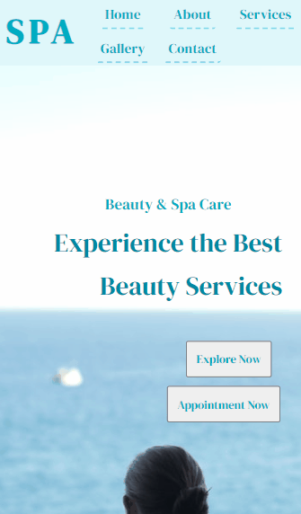

# Spa Landing Page 

Desenvolvimento de uma Landing Page simples para um Spa fictício. O usuário pode clicar nos links do menu para obter mais informações sobre os serviços oferecidos, sobre o local, mostrando fotos de produtos utilizados e como contatar o local, acessando o menu e indo para cada uma as seções.

[]

 [] 

## Meu processo

### Tecnologias utilizadas

- HTML
- CSS

### O que aprendi

Quis desenvolver essa landing page simples do zero baseada em alguns modelos e exercícios feitos, para praticar conceitos vistos até agora. Escolhi fazer uso de propriedades display: flex e grid juntas, entendendo como é totalmente possível usar as duas em conjunto. Também aplicando estilizações diferentes para o menu e em outras partes da página na uma versão responsiva.
